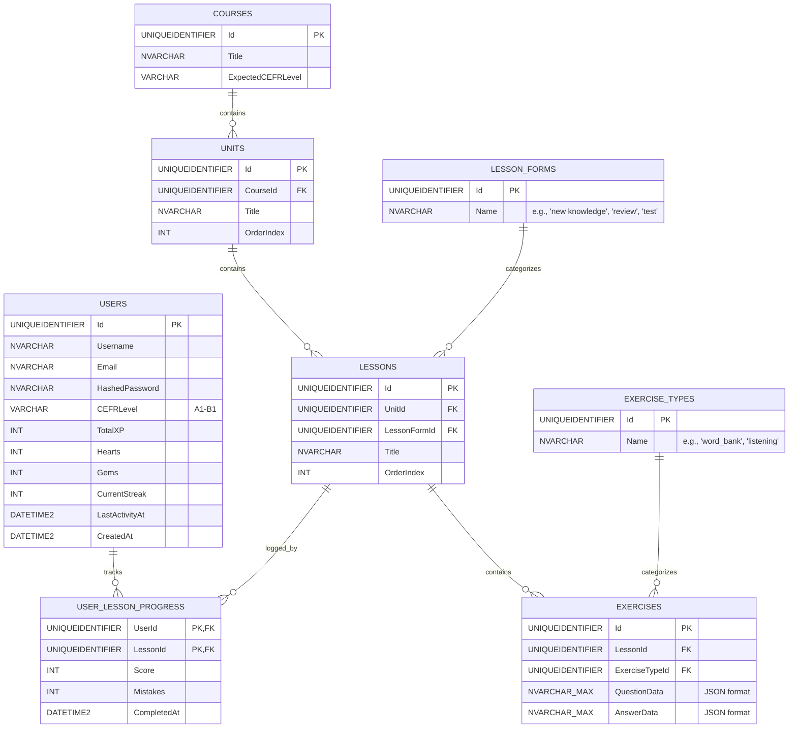

```mermaid
erDiagram
    USERS ||--o{ USER_LESSON_PROGRESS : tracks
    COURSES ||--o{ UNITS : contains
    UNITS ||--o{ LESSONS : contains
    LESSON_FORMS ||--o{ LESSONS : categorizes
    EXERCISE_TYPES ||--o{ EXERCISES : categorizes
    LESSONS ||--o{ EXERCISES : contains
    LESSONS ||--o{ USER_LESSON_PROGRESS : logged_by

    USERS {
        UNIQUEIDENTIFIER Id PK
        NVARCHAR Username
        NVARCHAR Email
        NVARCHAR HashedPassword
        VARCHAR CEFRLevel "A1-B1"
        INT TotalXP
        INT Hearts
        INT Gems
        INT CurrentStreak
        DATETIME2 LastActivityAt
        DATETIME2 CreatedAt
    }
    COURSES {
        UNIQUEIDENTIFIER Id PK
        NVARCHAR Title
        VARCHAR ExpectedCEFRLevel
    }
    UNITS {
        UNIQUEIDENTIFIER Id PK
        UNIQUEIDENTIFIER CourseId FK
        NVARCHAR Title
        INT OrderIndex
    }
    LESSON_FORMS {
        UNIQUEIDENTIFIER Id PK
        NVARCHAR Name "e.g., 'new knowledge', 'review', 'test'"
    }
    LESSONS {
        UNIQUEIDENTIFIER Id PK
        UNIQUEIDENTIFIER UnitId FK
        UNIQUEIDENTIFIER LessonFormId FK
        NVARCHAR Title
        INT OrderIndex
    }
    EXERCISE_TYPES {
        UNIQUEIDENTIFIER Id PK
        NVARCHAR Name "e.g., 'word_bank', 'listening'"
    }
    EXERCISES {
        UNIQUEIDENTIFIER Id PK
        UNIQUEIDENTIFIER LessonId FK
        UNIQUEIDENTIFIER ExerciseTypeId FK
        NVARCHAR_MAX QuestionData "JSON format"
        NVARCHAR_MAX AnswerData "JSON format"
    }
    USER_LESSON_PROGRESS {
        UNIQUEIDENTIFIER UserId PK, FK
        UNIQUEIDENTIFIER LessonId PK, FK
        INT Score
        INT Mistakes
        DATETIME2 CompletedAt
    }

```
