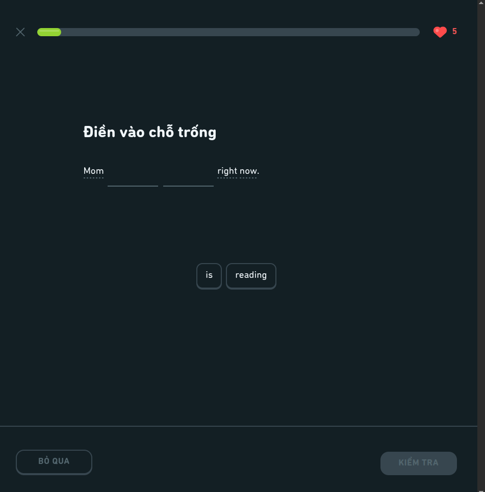
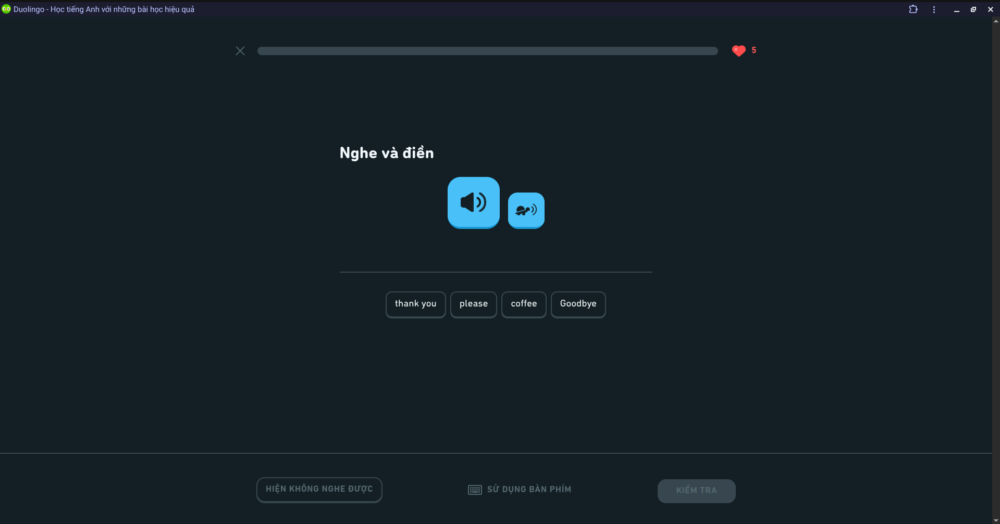
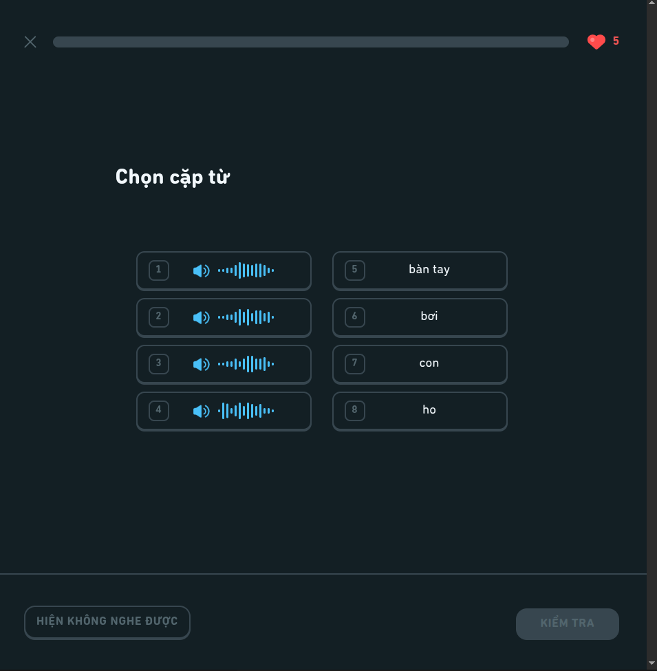
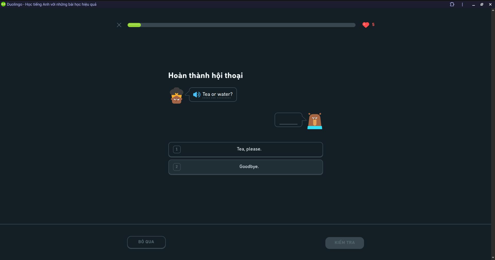

### **Exercise Specifications**

---

User will engage with a variety of interactive exercises (5 total)

#### **1. Word Bank**

- **Instruction:** The user constructs a sentence by selecting or dragging
  discrete word tokens from a randomized pool into a target area to match the
  source prompt.
- **Skeleton UI:**
  - **Prompt Container:** Text displaying the sentence to translate (L1 or L2).
  - **Target Dropzone:** An initially empty, bordered flex-container that
    receives selected tokens.
  - **Token Grid:** A flex-wrap layout containing draggable/clickable button
    elements representing individual words. Includes 2–3 decoy words.
  - **Action Bar:** "Check" button (disabled until at least one token is
    placed).

Database Schema:

- QuestionData:

  ```json
  {
    "instruction": "Điền vào chỗ trống",
    "text_template": "Mom {0} {1} right now.",
    "tokens": ["is", "reading", "are", "read"]
  }
  ```

- AnswerData:

  ```json
  {
    "correct_tokens": ["is", "reading"]
  }
  ```

Example:



#### **2. Listening**

- **Instruction:** The user listens to an audio snippet and transcribes the
  spoken phrase.
- **Skeleton UI:**
  - **Prompt Container:** Text reading "Type what you hear."
  - **Audio Controls:** \* Primary button: Play (normal speed).
    - Secondary button: Turtle icon (0.5x speed).
  - **Input Area:** A multiline text input field (or fallback to Word Bank mode
    for lower difficulty).
  - **Action Bar:** "Check" button and "Can't listen now" (disables audio
    exercises for 1 hour).



#### **3. Speaking**

- **Instruction:** The user reads the displayed text aloud. The system records
  the audio via Web Speech API for pronunciation evaluation.
- **Skeleton UI:**
  - **Prompt Container:** Text reading "Speak this sentence."
  - **Target Text:** The sentence to read, displayed in large typography.
  - **Interaction Area:** A central, prominent microphone button. Supports
    click-to-record or press-and-hold.
  - **Feedback State:** An active audio waveform animation or pulsing ring while
    the microphone is active.
  - **Action Bar:** "Check" button and "Can't speak now" (disables speaking
    exercises for 1 hour).

#### **4. Bidirectional Translation**

- **Instruction:** The user reads a sentence in the source language and types
  the full translation in the target language without the aid of a word bank.
- **Skeleton UI:**
  - **Prompt Container:** Text reading "Translate this sentence into [Target
    Language]."
  - **Source Text:** The sentence to translate. Includes hover states on words
    for dictionary hints (if enabled for the user's tier/level).
  - **Input Area:** An active multiline text area utilizing standard keyboard
    input.
  - **Action Bar:** "Check" button (disabled until input length > 0).

#### **5. Matching**

- **Instruction:** The user selects corresponding pairs from a grid of cards.
  Pairs consist of L1/L2 vocabulary mapping or text/image mapping.
- **Skeleton UI:**
  - **Prompt Container:** Text reading "Tap the matching pairs."
  - **Grid Layout:** A two-column (mobile) or multi-column flex grid containing
    text cards.
  - **Interaction States:**
    - _Default:_ Standard card styling.
    - _Selected:_ Highlighted border/background.
    - _Success:_ Green flash, then both cards fade out or are removed from the
      DOM.
    - _Error:_ Red flash, horizontal shake animation, then return to default
      state.
  - **Action Bar:** "Check" or "Continue" button (automatically triggers when
    the grid is cleared).



#### ~~Multiple choice~~


