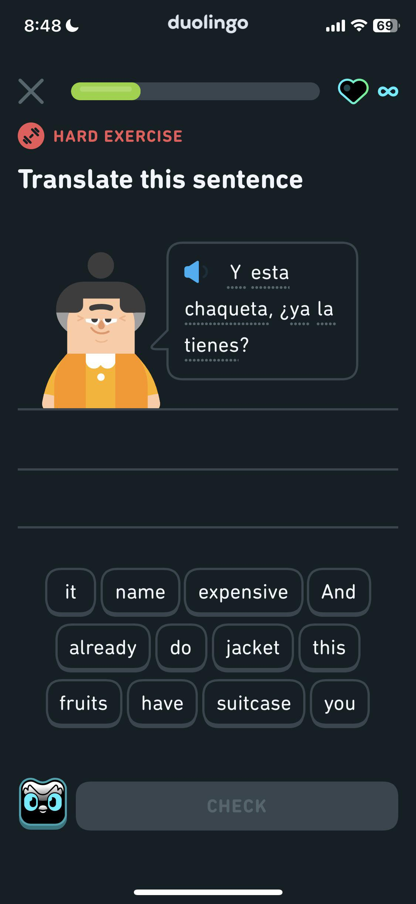
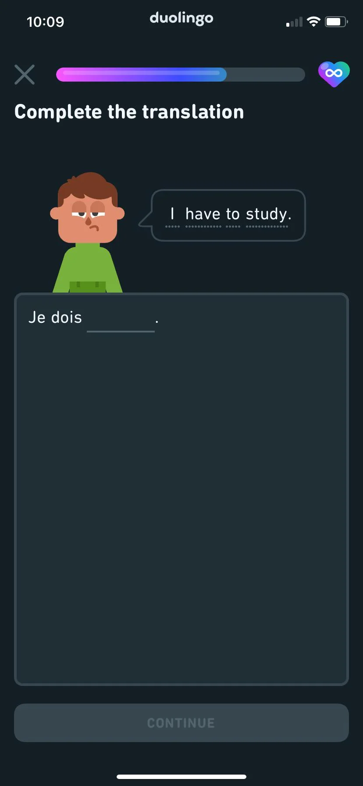
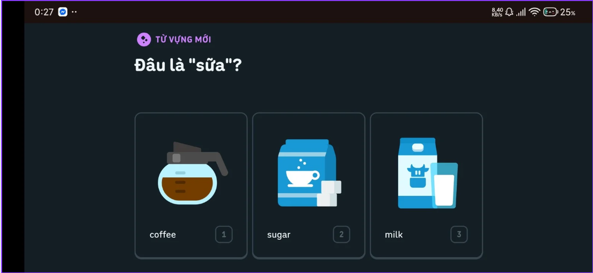
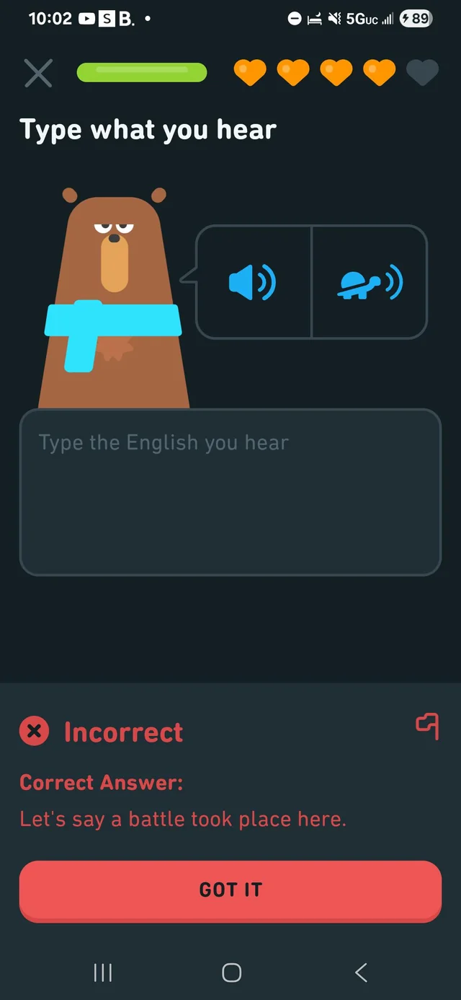
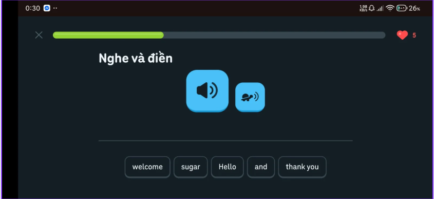
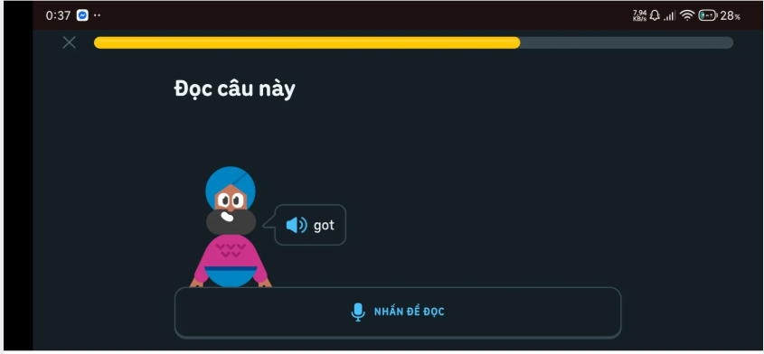

<style>
    img{
        width: 400px;
    }
</style>

## Arrange all the words: You are presented with a shuffled sentence in your target language and you have to rearrange the words to form a grammatically correct sentence

Database Schema:

- QuestionData:

  ```json
  {
    "instruction": "Arrange all the words",
    "tokens": ["sentence", "rearrange", "this", "to", "correctly"]
  }
  ```

- AnswerData:

  ```json
  {
    "correct_sequence": ["rearrange", "this", "sentence", "correctly"]
  }
  ```



## Complete the translation: A sentence is presented and its translation is missing a word and you must type it

Database Schema:

- QuestionData:

  ```json
  {
    "instruction": "Complete the translation",
    "source_sentence": "I have a cat.",
    "text_template": "Tôi có một con {0}."
  }
  ```

- AnswerData:

  ```json
  {
    "correct_words": ["mèo"]
  }
  ```



## Picture flashcard matching: You are presented with several words and corresponding images in one language and asked to choose which one matches a word in the other language.

Database Schema:

- QuestionData:

  ```json
  {
    "instruction": "Select the correct image for 'Apple'",
    "word": "Apple",
    "options": [
      {
        "id": "1",
        "text": "Quả táo",
        "image_url": "/images/apple.png"
      },
      {
        "id": "2",
        "text": "Quả cam",
        "image_url": "/images/orange.png"
      }
    ]
  }
  ```

- AnswerData:

  ```json
  {
    "correct_option_id": "1"
  }
  ```



## Type what you hear: You are presented with the audio of a sentence and are asked to transcribe it. A button labeled with a turtle repeats the sentence slowly.

Database Schema:

- QuestionData:

  ```json
  {
    "instruction": "Type what you hear",
    "audio_url": "/api/audio/sentence_normal.mp3",
    "slow_audio_url": "/api/audio/sentence_slow.mp3"
  }
  ```

- AnswerData:

  ```json
  {
    "correct_transcription": "This is what you heard."
  }
  ```



## Listen and choose: You are presented with the audio of a sentence and several written options. You must choose the correct one.

Database Schema:

- QuestionData:

  ```json
  {
    "instruction": "Listen and choose",
    "audio_url": "/api/audio/question.mp3",
    "options": [
      {
        "id": "A",
        "text": "Option A text"
      },
      {
        "id": "B",
        "text": "Option B text"
      }
    ]
  }
  ```

- AnswerData:

  ```json
  {
    "correct_option_id": "A"
  }
  ```



## Speak this sentence: You are presented with the text of a sentence and asked to speak it into your microphone.

Database Schema:

- QuestionData:

  ```json
  {
    "instruction": "Speak this sentence",
    "sentence": "I am learning to speak."
  }
  ```

- AnswerData:

  ```json
  {
    "expected_text": "I am learning to speak."
  }
  ```


